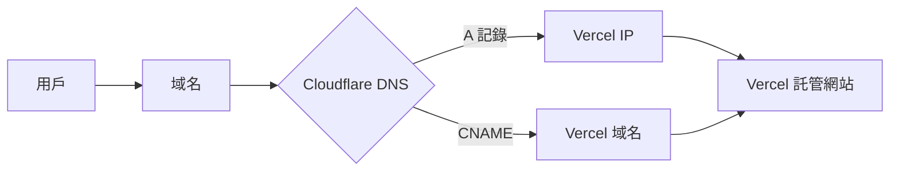
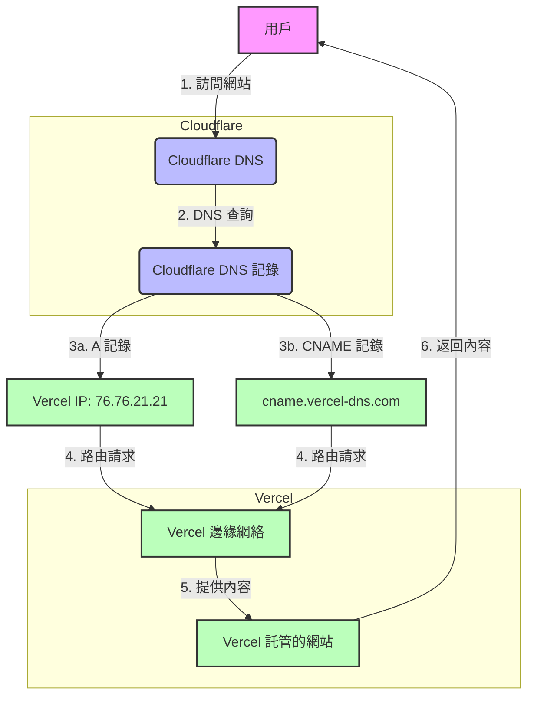

## 簡介

在現代網站開發中,選擇合適的域名和託管服務是關鍵步驟。本指南將帶你完成在 Cloudflare 購買域名,然後在 Vercel 上使用該域名的整個過程。這種組合能夠充分利用 Cloudflare 的強大 DNS 管理和安全功能,以及 Vercel 的高效網站託管服務。

## Vercel 與 Cloudflare 的關係

Vercel 和 Cloudflare 在 DNS（域名系統）方面的關係是一個有趣的話題。再進入主題之前，我們先深入探討一下兩者的關係：

1. DNS 管理：

   - Cloudflare 主要是一個 DNS 管理器和 CDN（內容分發網絡）提供商。
   - Vercel 主要是一個網站託管和部署平台。

2. 配置方式：

這個流程圖展示了用戶請求如何通過 Cloudflare 的 DNS 到達 Vercel 託管的網站。

3. 角色分工：

   - Cloudflare 負責 DNS 解析，將域名轉換為 IP 地址。
   - Vercel 負責實際的網站託管和內容服務。

4. 優勢組合：

   - Cloudflare 提供額外的安全層（如 DDoS 保護）和 CDN 功能。
   - Vercel 提供高效的靜態網站和 Serverless 函數託管。

5. DNS 記錄類型：

   - A 記錄：直接指向 Vercel 的 IP。
   - CNAME 記錄：指向 Vercel 的域名。

6. 潛在挑戰：

   - DNS 傳播延遲可能導致更改不立即生效。
   - Cloudflare 的代理功能可能與某些 Vercel 功能衝突。

7. 最佳實踐：

   - 使用 Cloudflare 的 DNS 只做解析，不啟用 Proxy 代理（橙色雲朵關閉）。
   - 在 Vercel 上正確配置自定義域名。
   - 確保 SSL/TLS 設置正確，以支持 HTTPS。

8. 靈活性：
   - 這種設置允許你利用兩個平台的優勢。
   - 可以輕鬆切換或調整服務，而無需更改整個基礎設施。

總的來說，Vercel 和 Cloudflare 在 DNS 配置中形成了一種互補的關係。Cloudflare 處理 DNS 管理和一些前端優化，而 Vercel 負責實際的網站託管和部署。這種組合為開發者提供了強大而靈活的網站託管解決方案。

## 系統架構

為了更好地理解 Cloudflare 域名和 Vercel 託管的工作方式，讓我們看一下下面的流程圖：

這個流程圖展示了以下步驟：

1. 用戶嘗試訪問你的網站。
2. 請求首先到達 Cloudflare 的 DNS 服務器。
3. Cloudflare DNS 根據設置的記錄類型進行解析：
   - 如果是 A 記錄，直接指向 Vercel 的 IP 地址 (76.76.21.21)。
   - 如果是 CNAME 記錄，指向 Vercel 的域名 (cname.vercel-dns.com)。
4. 請求被路由到 Vercel 的邊緣網絡。
5. Vercel 提供託管在其平台上的網站內容。
6. 內容通過相同的路徑返回給用戶。

這個架構結合了 Cloudflare 的 DNS 管理和安全功能，以及 Vercel 的高效託管和全球邊緣網絡，為網站提供卓越的性能和安全性。

## 步驟 1: 在 Cloudflare 購買域名

1. 登入 Cloudflare 帳戶或創建新帳戶。
2. 在儀表板中，找到並點擊「註冊域名」選項。
3. 搜尋你想要的域名，檢查可用性。
4. 選擇可用的域名，並進行購買流程。
5. 完成付款和必要的註冊資訊。

注意: Cloudflare 會自動將購買的域名添加到你的帳戶中並設置其 DNS。

## 步驟 2: 在 Vercel 設置項目

1. 登入你的 Vercel 帳戶。
2. 創建新項目或選擇現有項目。
3. 在項目設置中,找到「Domains」部分。
4. 添加你剛在 Cloudflare 購買的域名。

## 步驟 3: 配置 Cloudflare DNS

1. 返回 Cloudflare 儀表板。
2. 選擇你的域名,進入 DNS 設置。
3. 添加以下兩筆 DNS 記錄 (Record):
   | 域名類型 | 記錄類型 (Type) | 名稱(Name) | 目標(Target) |
   | ---------- | --------------- | ---------- | ------------------------------ |
   | 根域名 | A | @ | 76.76.21.21 (PS: Vercel 的 IP) |
   | www 子域名 | CNAME | \* | cname.vercel-dns.com |
4. 關閉 Cloudflare 的 Proxy 代理功能(橙色雲朵)，以避免與 Vercel 的某些功能衝突。

## 步驟 4: Cloudflare 設置優化

1. 在 Cloudflare 的 SSL/TLS 設置中,選擇「完全」或「完全(嚴格)」模式。
2. 在「網頁規則」中,確保沒有與你的域名衝突的規則。

## 步驟 5: 驗證和測試

1. 返回 Vercel,檢查域名設置是否顯示為已驗證。
2. 如果出現問題,可能需要等待 DNS 更改傳播(通常不超過 48 小時)。
3. 使用瀏覽器訪問你的域名,確保它正確指向 Vercel 項目。

## 最佳實踐和注意事項

- 在進行任何更改之前,記錄當前的 DNS 設置。
- 使用 HTTPS 確保網站安全。Vercel 和 Cloudflare 都提供免費的 SSL 證書。
- 定期檢查你的 DNS 設置,確保一切正常運作。
- 利用 Cloudflare 的安全功能,如 DDoS 保護和 Web 應用防火牆。
- 考慮使用 Cloudflare 的 CDN 功能來改善網站性能。

## 結論

通過結合 Cloudflare 的域名管理和 Vercel 的託管服務，我們可以創建一個強大、安全且高效的網站基礎設施。這個設置不僅提供了出色的性能和安全性,還為未來的擴展和調整提供了靈活性。

記住，網站管理是一個持續的過程。定期檢查和更新設置，以確保最佳性能和安全性。
